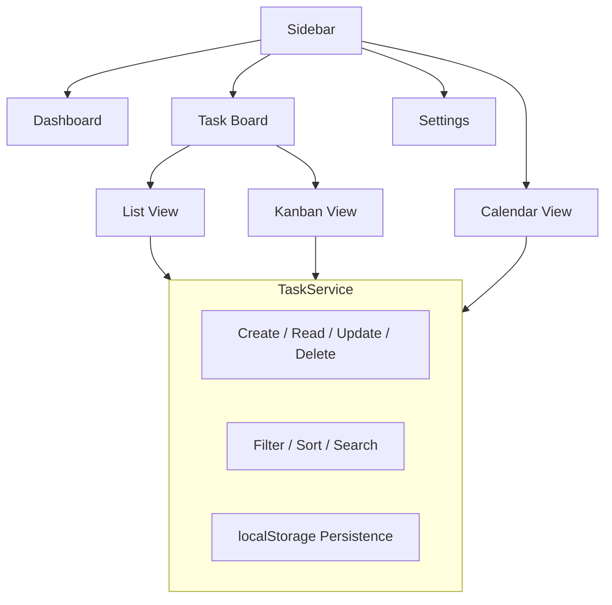

# SB Admin System

Angular 19 admin dashboard with Angular Material and SCSS.

## Prerequisites

- Node.js 22+
- npm 10+

## Setup

```bash
npm install
```

## Development

```bash
npm start
```

Open [http://localhost:4200](http://localhost:4200) in your browser.

## Build

```bash
npm run build
```

Output is in the `dist/` folder.

---

# Task Manager App - Feature Plan

## Architecture Overview

The task manager is a module inside the dashboard, accessible from the sidebar. All data uses a local service with localStorage persistence (same pattern as AuthService), ready to swap with a real API later.



---

## Phase 1: Core Task Features (Build First)

### 1.1 Task Data Model

- **Task properties:** id, title, description, status (todo / in-progress / done), priority (low / medium / high / urgent), category/label, due date, created date, completed date
- **TaskService** in `src/app/services/task.service.ts` using Angular signals + localStorage

### 1.2 Task List View

- New route `/dashboard/tasks` with component at `src/app/tasks/`
- Filterable table/list showing all tasks
- **Inline status toggle** - click to cycle through todo/in-progress/done
- **Priority badges** - color-coded chips (urgent=red, high=orange, medium=blue, low=gray)
- **Sort by** due date, priority, created date, status
- **Filter bar** - by status, priority, category
- **Search** - real-time text search across title and description
- **Bulk actions** - select multiple tasks, mark done, delete

### 1.3 Task Create/Edit

- **Quick add** - inline input at top of list for fast task creation (title + Enter)
- **Full dialog** - Mat Dialog for detailed editing with all fields (title, description, priority, category, due date)
- **Date picker** - Angular Material datepicker for due dates
- **Category tags** - create and assign custom color-coded labels

### 1.4 Task Delete

- Soft delete with confirmation dialog
- Undo via snackbar (3-second window)

---

## Phase 2: Views and Organization

### 2.1 Kanban Board View

- Drag-and-drop columns: **To Do** | **In Progress** | **Done**
- Uses Angular CDK `DragDropModule` (already available, no new dependency)
- Task cards show title, priority chip, due date, category
- Drag a card between columns to update status

### 2.2 Calendar View

- Monthly calendar grid showing tasks on their due dates
- Click a date to see tasks due that day
- Visual indicators for overdue (red dot), due today (orange), upcoming (green)

### 2.3 Dashboard Widgets

- Replace the empty dashboard home page with:
  - **Stats row** - Total tasks, Completed today, Overdue, Due this week
  - **Upcoming tasks** - next 5 tasks by due date
  - **Progress ring** - completion percentage
  - **Recent activity** - last 5 task changes

---

## Phase 3: Productivity Features

### 3.1 Subtasks / Checklist

- Each task can have child subtasks (checkbox list)
- Progress bar on parent task showing subtask completion %

### 3.2 Recurring Tasks

- Option to set tasks as daily / weekly / monthly recurring
- Auto-creates next instance when current one is completed

### 3.3 Labels and Categories

- Create custom categories with name + color
- Assign multiple labels per task
- Filter/group tasks by category

### 3.4 Due Date Reminders

- Visual indicators: overdue (red), due today (amber), due this week (blue)
- Notification badge in toolbar updates with overdue count

### 3.5 Task Notes / Comments

- Rich text area per task for notes
- Timestamp on each note entry

---

## Phase 4: Advanced Features

### 4.1 Search and Filters

- Global search across all tasks from toolbar
- Saved filter presets (e.g., "My Overdue Tasks", "High Priority This Week")
- Keyboard shortcut `Ctrl+K` to open quick search

### 4.2 Import / Export

- Export tasks as CSV or JSON
- Import from CSV

### 4.3 Dark Mode

- Toggle in settings to switch the entire app theme
- Persisted in localStorage

### 4.4 Task Analytics

- Completion trends chart (tasks done per day/week)
- Average completion time
- Category breakdown pie chart
- Productivity score

---

## Sidebar Navigation

```
navItems = [
  { icon: 'dashboard',      label: 'Dashboard', route: '/dashboard' },
  { icon: 'task_alt',       label: 'Tasks',     route: '/dashboard/tasks' },
  { icon: 'view_kanban',    label: 'Board',     route: '/dashboard/board' },
  { icon: 'calendar_month', label: 'Calendar',  route: '/dashboard/calendar' },
  { icon: 'settings',       label: 'Settings',  route: '/dashboard/settings' },
];
```

---

## File Structure

```
src/app/
  services/
    task.service.ts          (signal-based CRUD + localStorage)
  tasks/
    task-list/               (main list view with filters)
    task-dialog/             (create/edit dialog)
    task-board/              (kanban drag-drop view)
    task-calendar/           (calendar view)
    shared/
      task-card/             (reusable task card component)
      priority-badge/        (priority chip component)
      category-tag/          (label chip component)
```

---

## Recommended Build Order

Start with Phase 1 (core CRUD, list view, create/edit dialog) as it forms the foundation. Each subsequent phase builds on top without breaking existing functionality.
